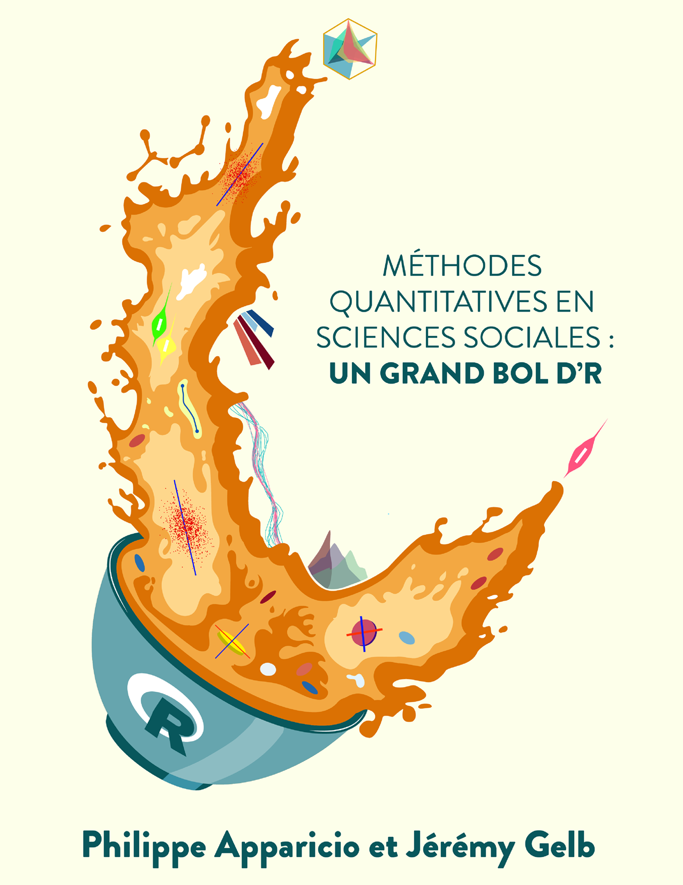
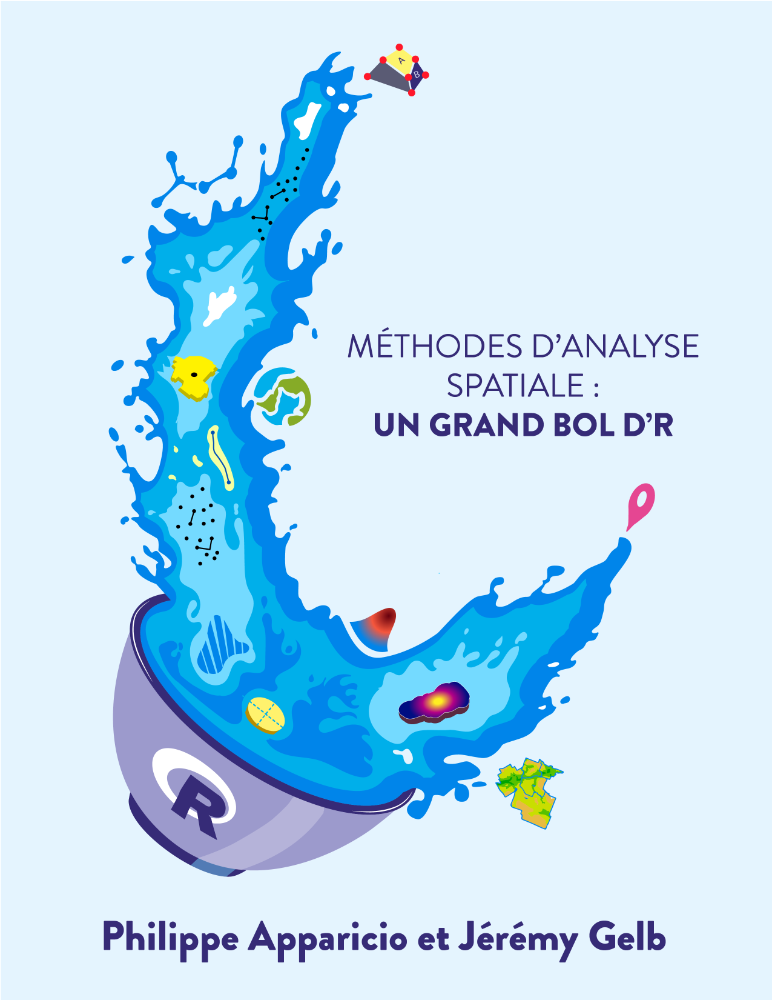

# Série *Un grand bol d'R*

La série ***UnGrand Bol d'R*** regroupe plusieurs manuels sur R sous la direction de [Philippe Apparicio](https://www.usherbrooke.ca/recherche/fr/specialistes/details/philippe.apparicio) (professeur titulaire, [Département de géomatique appliquée](https://www.usherbrooke.ca/geomatique/) de l'[Université de Sherbrooke](https://www.usherbrooke.ca/)) et de Jérémy Gelb (conseiller en science des données à l'[Autorité régionale de transport métropolitain](https://www.artm.quebec/a-propos-de-l-artm/mission/)).

Ces manuels sont intégralement écrits avec [Quarto](https://quarto.org/). À ce jour, deux manuels sont disponibles :

1.  Apparicio Philippe et Jérémy Gelb (2024). [*Méthodes quantitatives en sciences sociales : un grand bol d'R*](https://serieboldr.github.io/MethodesQuantitatives/). Deuxième édition, Université de Sherbrooke, Département de géomatique appliquée. fabriqueREL. Licence CC BY-SA.

2.  Apparicio Philippe et Jérémy Gelb (2024). [*Méthodes d'analyse spatiales : un grand bol d'R*](https://serieboldr.github.io/MethodesAnalyseSpatiale/). Université de Sherbrooke, Département de géomatique appliquée. fabriqueREL. Licence CC BY-SA.

<table border="0", style="border:none;">
  <tr>
    <td style="text-align:center">
      
    </td>
    <td style="text-align:center">
      
    </td>
  </tr>
</table>
